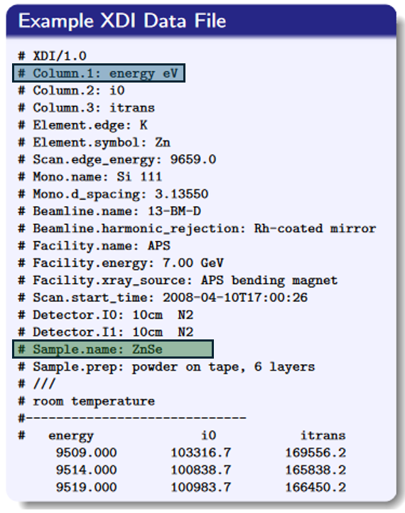
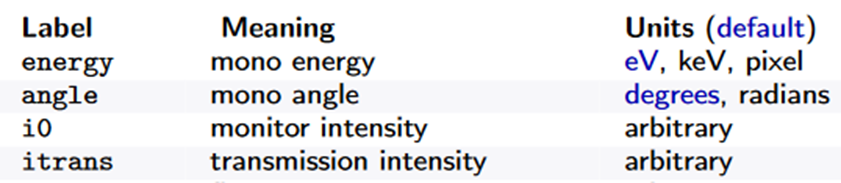
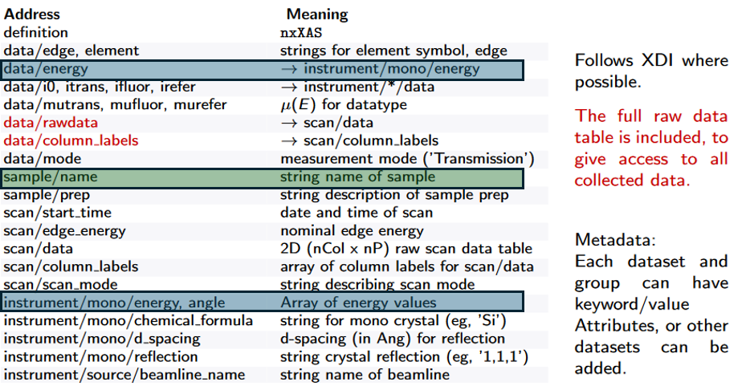
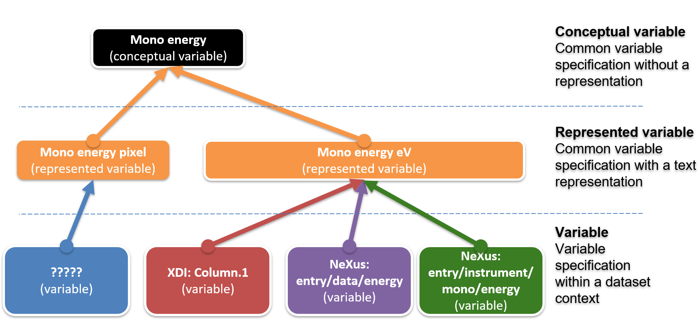

# X-ray absorption spectroscopy to CDI

In x-ray absorption spectroscopy two main standards but many to standardised datasets are produced.
The two standards are converging by renewing the NeXus NXxas application definition and adopting the requriements defined in the XAS community using the XDI standard.  

In this presentation you can find more explanations:  
https://millenia.cars.aps.anl.gov/nxxas/Presentation/Newville_Q2XAFS2023.pdf

From this presentation the following example is taken:  
Highlightened are the fields **energy** and **sample name**. In the following we will use energy as an example to create the first description of the related concepts and data structures in DDI-CDI.  

For modelling the concepts in DDI-CDI. The variable cascade has been applied.  

