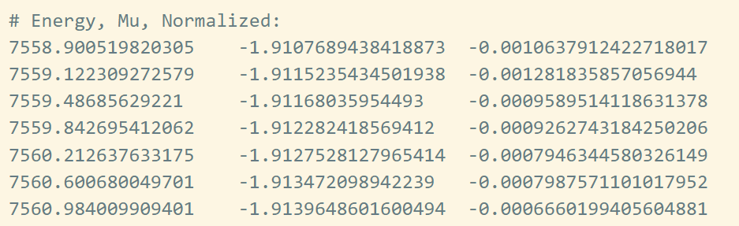
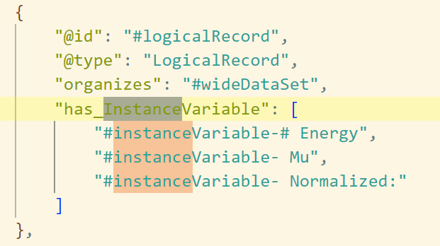
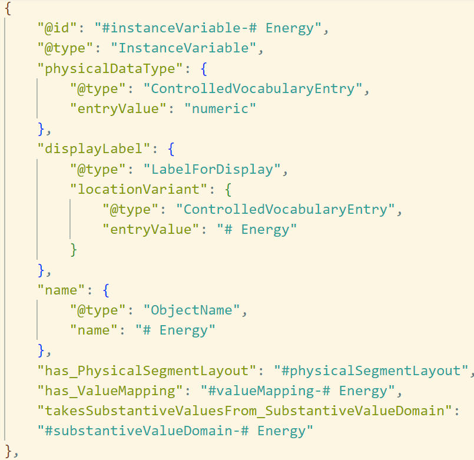

# X-ray absorption spectroscopy to CDI

## Introduction
### [Variable cascade](#Variable_cascade)
### [Data structure](#Data_structure)
### [Example](#Example)

In x-ray absorption spectroscopy two main standards but many to standardised datasets are produced.
The two standards are converging by renewing the NeXus NXxas application definition and adopting the requriements defined in the XAS community using the XDI standard.  

In this presentation you can find more explanations:  
https://millenia.cars.aps.anl.gov/nxxas/Presentation/Newville_Q2XAFS2023.pdf

### Variable cascade
From this presentation the following example is taken to describe the variable casade:  
Highlightened are the fields **energy** and **sample name**. In the following we will use energy as an example to create the first description of the related concepts and variable cascade in DDI-CDI.  

For modelling the concepts in DDI-CDI. The variable cascade has been applied.  

  
### Data structure
Missing ?????  

### Example

In order to work with real data the following example was downloaded from the RefXAS database:  
[http://xafsdb.ddns.net/dataset/details/PID.SAMPLE.PREFIX683cae10-2de9-4cbf-895a-5c09eff530ba?](http://xafsdb.ddns.net/dataset/details/PID.SAMPLE.PREFIX683cae10-2de9-4cbf-895a-5c09eff530ba?)  
TODO: This data can be expressed in RefXAS, XDI, and NeXus.(still need to convert to XDI and NeXus)  
To start the table of the RefXAS (file)[example/PID.SAMPLE.PREFIX683cae10-2de9-4cbf-895a-5c09eff530ba_metaData.txt] was uploaded to [https://ddi-cdi-converter-app.azurewebsites.net/](https://ddi-cdi-converter-app.azurewebsites.net/). 
This gave me a [json-ld ](example/PID.SAMPLE.PREFIX683cae10-2de9-4cbf-895a-5c09eff530ba_metaData_DDICDI.jsonld) structure of the table expressed in DDI-CDI. I did not upload the whole file because I have no clue how to deal with the header.  

The file I have uploaded has three columns and looks like this:  
  

The ddi.cdi converter gave me back a json-ld file with an overview of the instance variables:  
  

The contents of the Energy column Instance variable is:  
  

Having the instance variables, they can now be connected to the variable cascade. As we had three different files one ConceptVariable of the variable cascade will now cascade down to three instance variables as each file type will have one instance variable. These three instance variable will express the same concept. The XDI file and the NeXus file still nedd to created, but theoretically it will be like this.(TODO: once we have created them for XDI and NeXus). As we had the same original file thus the same units are applied and we will only have one representative variable.  
TODO: As I am working with RDF/XML syntax the json-ld needs to be transformed.

For the Units also QUDT with cdi:ControlledVocabularyEntry and  cdi:RepresentedVariable-describedUnitOfMeasure coud be used.